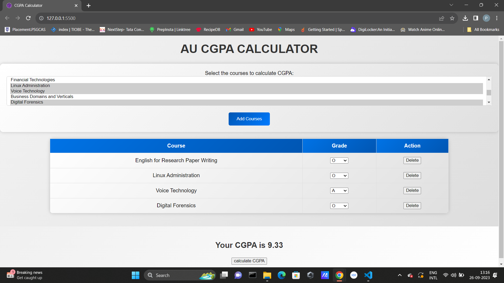

# AU CGPA Calculator



This web-based CGPA (Cumulative Grade Point Average) calculator is designed for students at AU (Acme University) to easily calculate their CGPA based on their course credits and letter grades. The calculator provides a user-friendly interface for adding courses and their corresponding grades, and it displays the calculated CGPA.

## Features

- Select courses and their respective grades.
- Calculate CGPA based on course credits and letter grades.
- User-friendly and intuitive design.

## How to Use

1. Load the page by opening the `index.html` file in your web browser.

2. In the course selection form, select the courses for which you want to calculate CGPA. You can select multiple courses.

3. Click the "Add Courses" button to add the selected courses to the table.

4. In the table, select the corresponding letter grades for each course from the drop-down menus.

5. Once you've added all your courses and grades, click the "Calculate CGPA" button.

6. Your CGPA will be displayed below the table.

## Installation

1. Clone the repository to your local machine:

   ```shell
   git clone https://github.com/yourusername/Au-Cgpa-Calculator.git
